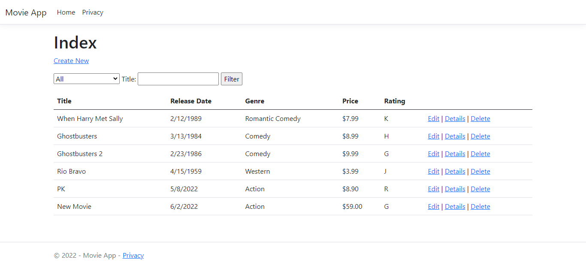

# MvcMovie

ASP.NET Core MVC web development with controllers and views. I learn from this tutorial

- Create a web app.
- Add and scaffold a model.
- Work with a database.
- Add search and validation.

## ScreenShot

